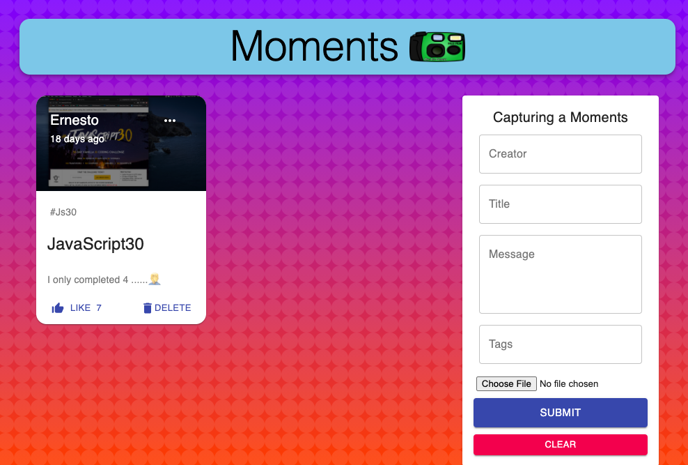

## Moments
Allows Clients to save a postcard card with and image, brief description and location . The application was a way to allow users to share their travel experiences

#link 
https://capture-moments.netlify.app/

## Decription
The web application allows clients to create digital postcard to capture their travels. They can upload an image and short description to the card. The application is using MongoDB for it database and React as it front end framework. Netlify was used to deploy the client side while the database was deployed with Heroku. 

## Motivation
I wanted to create a mini social media application that allowed users to share a digital post card of their travels. 

## Screenshots

## Features
Validation and Authentication coming soon!!

## Installation
[clone repo, run npm install ,npm start ]

## How to use?
Enter Creator, title , short message, hashtag, upload a file . click submit. this will create a digital postcard. 

